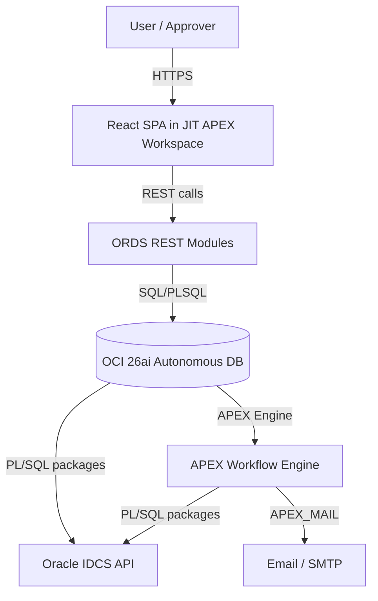
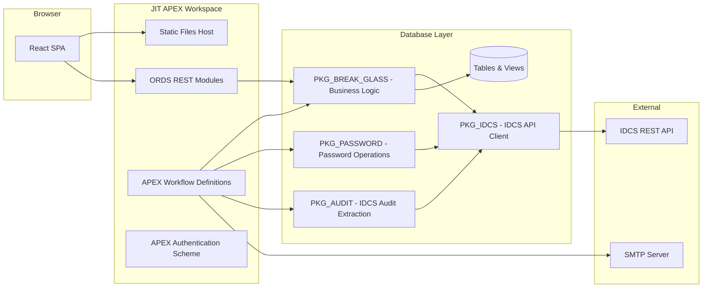
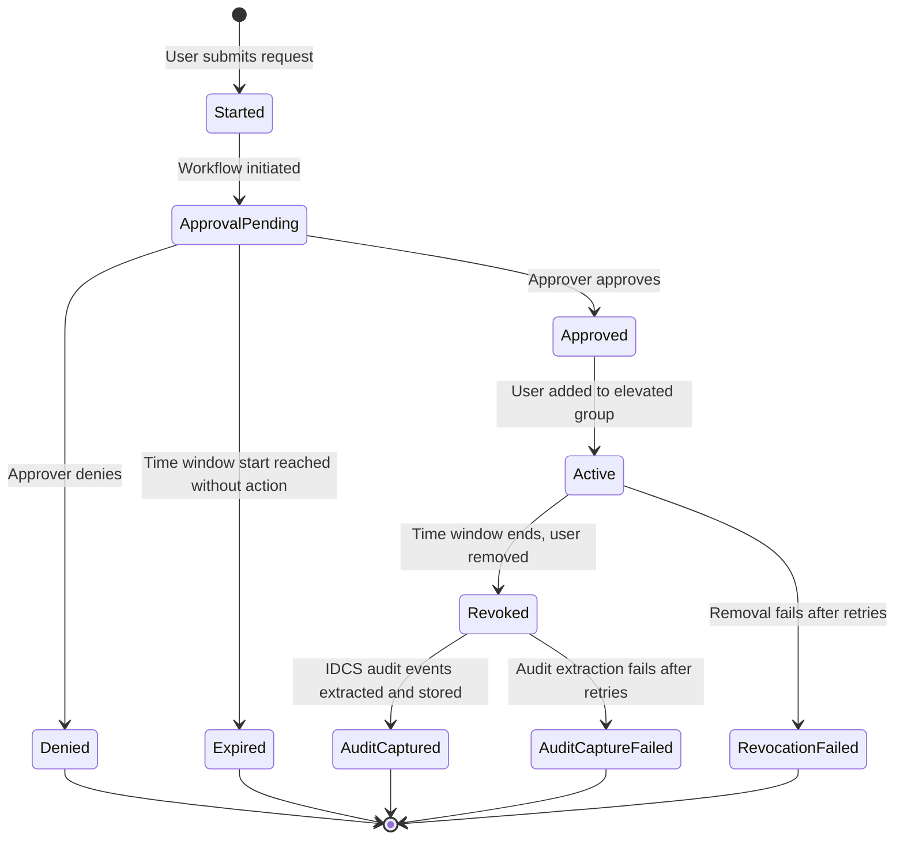
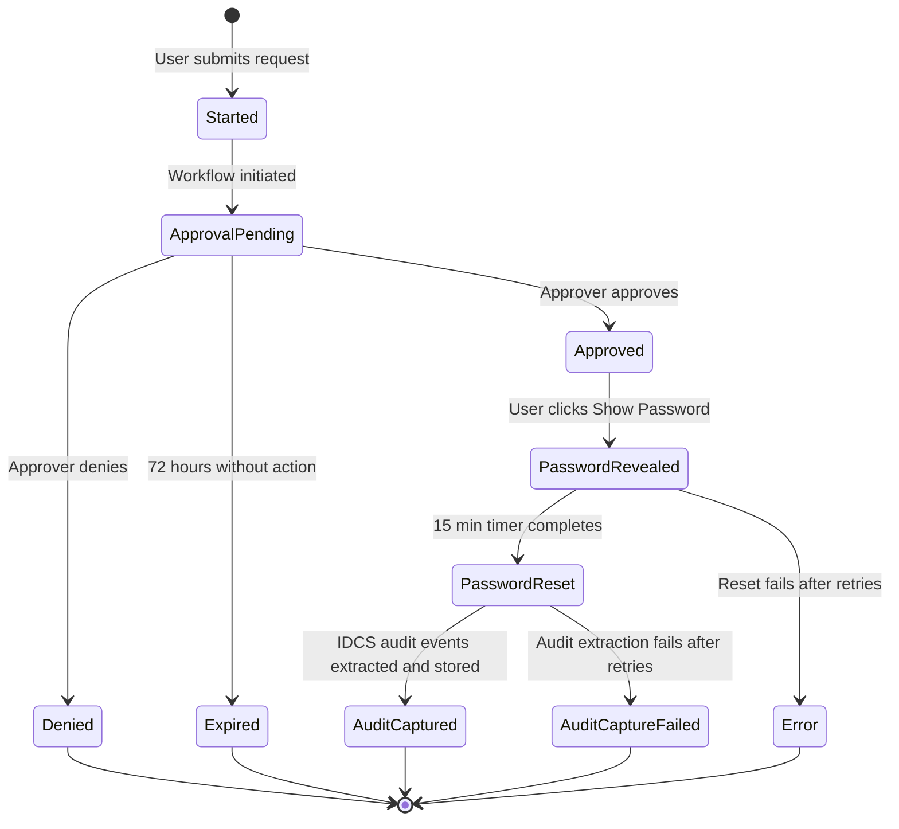
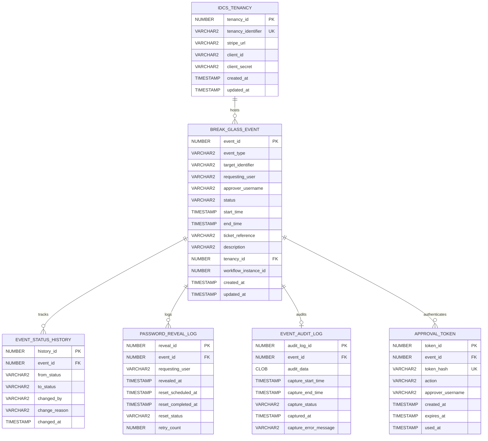

# Design Document: JIT Break Glass

## Overview

JIT Break Glass is a self-service tool enabling time-bounded elevated access through two mechanisms: IDCS Group elevation and IDCS User Password retrieval. The system is built as a React single-page application deployed as static files in the Oracle APEX workspace named **JIT**. It communicates with an OCI 26ai Autonomous Database via ORDS RESTful APIs, and uses Oracle APEX Workflows for orchestrating approval and lifecycle processes. Integration with Oracle IDCS provides group membership discovery, user management, and password operations.

### Key Design Decisions

1. **Static React app in APEX workspace**: The front-end is a standalone React build deployed into the APEX static file area of the **JIT** workspace. This decouples UI development from APEX page authoring while leveraging APEX authentication.
2. **ORDS as API layer**: All database and IDCS interactions are mediated through ORDS REST modules. The React app never connects directly to the database or IDCS.
3. **APEX Workflows for lifecycle**: Approval, scheduling, grant/revoke, and password reset are orchestrated by APEX Workflow definitions. This provides durability, retry logic, and auditability without custom scheduler code.
4. **Database-stored IDCS credentials**: Tenancy connection details and keys are stored in the database, retrieved by PL/SQL packages that perform IDCS API calls on behalf of the workflow engine and ORDS handlers.

## Architecture

### System Context Diagram



### Component Architecture



### Authentication Flow

1. User navigates to the JIT APEX workspace URL hosting the React app.
2. APEX Authentication Scheme (IDCS OAuth2) authenticates the user.
3. Upon successful authentication, APEX session is established.
4. The React app calls an ORDS endpoint to fetch the authenticated user's IDCS groups.
5. ORDS handler calls `PKG_IDCS.get_user_groups` which uses stored tenancy credentials to query the IDCS API.
6. Group memberships are returned to the React app and cached in the browser session (React state/context).

### Request Lifecycle (Group Break-Glass)



### Request Lifecycle (Password Break-Glass)



## Components and Interfaces

### React Front-End Components

| Component | Responsibility |
|-----------|---------------|
| `App` | Root component, manages authentication state and routing |
| `AuthProvider` | Context provider wrapping the app; fetches and caches IDCS groups on mount |
| `TargetDiscovery` | Parses user groups into valid Group_Combinations and User_Combinations |
| `GroupRequestForm` | Form for submitting group break-glass requests (time window, ticket, description, approver) |
| `PasswordRequestForm` | Form for submitting password break-glass requests |
| `ApproverSelector` | Fetches and displays approver list from the relevant approvers group |
| `MyRequestsScreen` | The "My Requests" screen; displays all break-glass events submitted by the authenticated user, sorted by creation date descending. Each event ticket shows a "Status" button (opens WorkflowDiagram) and an "Audit Trail" button (opens EventAuditTrail) when audit data is available. |
| `MyApprovalsScreen` | The "My Approvals" screen; displays all break-glass events where the authenticated user is the designated approver, sorted by creation date descending. Shows "Approve" and "Deny" buttons for events with status `approval_pending`. Non-pending events display their current status without action buttons. |
| `EventDetail` | Shows full event details including status timeline; includes a "Status" button that opens the WorkflowDiagram and an "Audit Trail" button that opens EventAuditTrail when audit data is captured |
| `WorkflowDiagram` | Renders the workflow lifecycle as a visual step diagram with distinct states (completed, active, pending); auto-refreshes every 30 seconds via polling the workflow-status endpoint |
| `PasswordReveal` | Handles "Show Password" button logic and displays the revealed password |
| `AdminTenancyManager` | CRUD interface for managing IDCS tenancy records (admin only) |
| `EventAuditTrail` | Displays the IDCS audit events attached to a break-glass event (visible to owner, approver, admin). Triggered by the "Audit Trail" button present on event tickets in both My Requests and My Approvals screens. |

### PL/SQL Packages

| Package | Responsibility |
|---------|---------------|
| `PKG_IDCS` | Low-level IDCS REST API client: OAuth token management, group membership queries, user password set, group member add/remove |
| `PKG_BREAK_GLASS` | Business logic: request validation, event creation, status transitions, authorization checks |
| `PKG_PASSWORD` | Password generation (secure random, 16+ chars, mixed character classes), password reset scheduling |
| `PKG_AUDIT` | IDCS audit event extraction: queries IDCS Audit API for a user within a time range, stores results as JSON, handles retries |
| `PKG_NOTIFICATIONS` | Email composition and sending via APEX_MAIL; generates tokenized one-click action URLs for approve/deny buttons embedded in approval notification emails |
| `PKG_APPROVAL_TOKENS` | Generates and validates single-use security tokens for email-based approval actions; tokens are stored in the database with expiry and are invalidated after first use |

### ORDS REST Modules

**ORDS Base URL**: `https://ldldfcndl8jbd1z-jitdemodatabase.adb.uk-london-1.oraclecloudapps.com/ords/`

All module paths below are relative to this base URL. For example, the full URL for the auth module would be `https://ldldfcndl8jbd1z-jitdemodatabase.adb.uk-london-1.oraclecloudapps.com/ords/jit/v1/auth/`.

| Module | Base Path | Purpose |
|--------|-----------|---------|
| `jit_auth` | `/jit/v1/auth/` | Authentication info and group retrieval |
| `jit_events` | `/jit/v1/events/` | Break-glass event CRUD |
| `jit_targets` | `/jit/v1/targets/` | Target discovery (groups and users) |
| `jit_password` | `/jit/v1/password/` | Password reveal action |
| `jit_admin` | `/jit/v1/admin/` | IDCS tenancy administration |
| `jit_approvals` | `/jit/v1/approvals/` | Approver actions (approve/deny) — supports both authenticated session calls from the React UI and tokenized one-click actions from approval emails |
| `jit_audit` | `/jit/v1/audit/` | Audit trail data retrieval for break-glass events |

### APEX Workflow Definitions

| Workflow | Trigger | Purpose |
|----------|---------|---------|
| `WF_GROUP_BREAK_GLASS` | Event creation (group type) | Orchestrates approval → grant → revoke → audit capture lifecycle |
| `WF_PASSWORD_BREAK_GLASS` | Event creation (password type) | Orchestrates approval → password management → audit capture lifecycle |
| `WF_PASSWORD_RESET` | Password reveal action | 15-minute delayed password reset with retries |

### Interface Contracts

#### ORDS Endpoint: POST /jit/v1/events/

Request:
```json
{
  "event_type": "GROUP" | "PASSWORD",
  "target_identifier": "<group_name or user_name>",
  "start_time": "ISO8601 datetime",
  "end_time": "ISO8601 datetime",
  "ticket_reference": "string (1-100 chars)",
  "description": "string (1-500 chars)",
  "approver_username": "string | null"
}
```

Response (201 Created):
```json
{
  "event_id": "number",
  "status": "started",
  "created_at": "ISO8601 datetime"
}
```

#### ORDS Endpoint: GET /jit/v1/events/

Response (200 OK):
```json
{
  "items": [
    {
      "event_id": "number",
      "event_type": "GROUP" | "PASSWORD",
      "target_identifier": "string",
      "status": "string",
      "start_time": "ISO8601 datetime",
      "end_time": "ISO8601 datetime",
      "ticket_reference": "string",
      "description": "string",
      "approver_username": "string | null",
      "created_at": "ISO8601 datetime",
      "updated_at": "ISO8601 datetime"
    }
  ]
}
```

#### ORDS Endpoint: POST /jit/v1/password/reveal

Request:
```json
{
  "event_id": "number"
}
```

Response (200 OK):
```json
{
  "password": "string",
  "expires_in_minutes": 15
}
```

#### ORDS Endpoint: PUT /jit/v1/approvals/:event_id

Request:
```json
{
  "action": "APPROVE" | "DENY",
  "comment": "string (optional)"
}
```

Response (200 OK):
```json
{
  "event_id": "number",
  "status": "approved" | "denied",
  "actioned_at": "ISO8601 datetime"
}
```

#### ORDS Endpoint: POST /jit/v1/approvals/token-action

Handles one-click approve/deny actions triggered from approval notification emails. The token authenticates the approver and identifies the event and intended action, eliminating the need for an active session.

Request:
```json
{
  "token": "string (single-use security token)"
}
```

Response (200 OK):
```json
{
  "event_id": "number",
  "action": "APPROVE" | "DENY",
  "status": "approved" | "denied",
  "actioned_at": "ISO8601 datetime"
}
```

Response (400 Bad Request): Token is missing or malformed.

Response (401 Unauthorized): Token is invalid, already used, or expired.

Response (409 Conflict): Event is no longer in `approval_pending` status (already actioned or expired).

**Token Design:**
- Each approval email contains two tokenized URLs: one for approve, one for deny.
- Tokens are cryptographically random (32+ bytes, URL-safe base64 encoded).
- Each token is stored in an `APPROVAL_TOKEN` table with: `token_hash` (SHA-256), `event_id`, `action` (APPROVE/DENY), `approver_username`, `created_at`, `expires_at` (same as event start_time or 72h, whichever is sooner), and `used_at` (null until consumed).
- Tokens are single-use: once consumed (used_at is set), any subsequent use is rejected.
- Token lookup uses the hash to prevent timing attacks.

#### ORDS Endpoint: GET /jit/v1/approvals/

Returns all Break_Glass_Events where the authenticated user is the designated approver, sorted by creation date descending. Used by the `MyApprovalsScreen` component.

Response (200 OK):
```json
{
  "items": [
    {
      "event_id": "number",
      "event_type": "GROUP" | "PASSWORD",
      "target_identifier": "string",
      "requesting_user": "string",
      "status": "string",
      "start_time": "ISO8601 datetime",
      "end_time": "ISO8601 datetime",
      "ticket_reference": "string",
      "description": "string",
      "created_at": "ISO8601 datetime",
      "updated_at": "ISO8601 datetime"
    }
  ]
}
```

#### ORDS Endpoint: GET /jit/v1/targets/

Response (200 OK):
```json
{
  "group_targets": [
    {
      "group_name": "string",
      "elevated_group": "string",
      "approvers_group": "string"
    }
  ],
  "password_targets": [
    {
      "user_name": "string",
      "elevated_group": "string",
      "approvers_group": "string"
    }
  ]
}
```

#### ORDS Endpoint: GET /jit/v1/targets/:type/:name/approvers

Response (200 OK):
```json
{
  "approvers": [
    {
      "username": "string",
      "display_name": "string",
      "email": "string"
    }
  ]
}
```

#### ORDS Endpoint: GET /jit/v1/audit/:event_id

Returns the IDCS audit trail data attached to a break-glass event. Only accessible by the event owner, the designated approver, or a system administrator.

Response (200 OK):
```json
{
  "event_id": "number",
  "capture_status": "captured" | "failed" | "pending",
  "capture_start_time": "ISO8601 datetime",
  "capture_end_time": "ISO8601 datetime",
  "captured_at": "ISO8601 datetime | null",
  "capture_error_message": "string | null",
  "audit_events": [
    {
      "event_type": "string",
      "timestamp": "ISO8601 datetime",
      "actor": "string",
      "action": "string",
      "target": "string",
      "details": "object"
    }
  ]
}
```

Response (404 Not Found): Event does not exist or no audit data has been captured yet.

Response (403 Forbidden): User is not authorized to view this event's audit trail.

#### ORDS Endpoint: GET /jit/v1/events/:event_id/workflow-status

Returns the workflow step definitions for the event's type and the current active step.

Response (200 OK):
```json
{
  "event_id": "number",
  "event_type": "GROUP" | "PASSWORD",
  "current_status": "string",
  "is_terminal": "boolean",
  "steps": [
    {
      "step_key": "string",
      "label": "string",
      "state": "completed" | "active" | "pending"
    }
  ]
}
```

The `steps` array is ordered by lifecycle position. For GROUP events the steps are: `started`, `approval_pending`, `approved_or_denied`, `grant_added`, `grant_revoked`, `audit_captured`. For PASSWORD events the steps are: `started`, `approval_pending`, `approved_or_denied`, `password_revealed`, `password_reset`, `audit_captured`.

Step `state` values are computed as:
- `completed`: the step's position in the lifecycle is before the current status position
- `active`: the step matches the current status (omitted when event is in a terminal state)
- `pending`: the step's position in the lifecycle is after the current status position

When the event is in a terminal state (`denied`, `expired`, `error`, `revocation_failed`, `audit_capture_failed`), all reached steps are `completed` and no step is `active`.

Response (404 Not Found): Event does not exist.

Response (403 Forbidden): User is not authorized to view this event.

## Data Models

### Entity Relationship Diagram



### Table Definitions

#### IDCS_TENANCY

| Column | Type | Constraints | Description |
|--------|------|-------------|-------------|
| tenancy_id | NUMBER | PK, GENERATED ALWAYS AS IDENTITY | Surrogate primary key |
| tenancy_identifier | VARCHAR2(100) | NOT NULL, UNIQUE | Human-readable tenancy identifier |
| stripe_url | VARCHAR2(500) | NOT NULL | IDCS stripe base URL |
| client_id | VARCHAR2(200) | NOT NULL | OAuth2 client ID for IDCS API access |
| client_secret | VARCHAR2(500) | NOT NULL | OAuth2 client secret (encrypted at rest via TDE) |
| created_at | TIMESTAMP WITH TIME ZONE | NOT NULL, DEFAULT SYSTIMESTAMP | Record creation time |
| updated_at | TIMESTAMP WITH TIME ZONE | NOT NULL, DEFAULT SYSTIMESTAMP | Last modification time |

#### BREAK_GLASS_EVENT

| Column | Type | Constraints | Description |
|--------|------|-------------|-------------|
| event_id | NUMBER | PK, GENERATED ALWAYS AS IDENTITY | Surrogate primary key |
| event_type | VARCHAR2(20) | NOT NULL, CHECK IN ('GROUP','PASSWORD') | Type of break-glass request |
| target_identifier | VARCHAR2(200) | NOT NULL | Target group name or user name |
| requesting_user | VARCHAR2(200) | NOT NULL | Username of the requesting user |
| approver_username | VARCHAR2(200) | NULL | Username of selected approver (null if auto-approved) |
| status | VARCHAR2(30) | NOT NULL, DEFAULT 'started' | Current event status |
| start_time | TIMESTAMP WITH TIME ZONE | NOT NULL | Requested start of elevated access |
| end_time | TIMESTAMP WITH TIME ZONE | NOT NULL | Requested end of elevated access |
| ticket_reference | VARCHAR2(100) | NOT NULL | External ticket/incident reference |
| description | VARCHAR2(500) | NOT NULL | User-provided justification |
| tenancy_id | NUMBER | NOT NULL, FK → IDCS_TENANCY | Associated IDCS tenancy |
| workflow_instance_id | NUMBER | NULL | APEX Workflow instance identifier |
| approval_comment | VARCHAR2(1000) | NULL | Approver's comment on approval/denial |
| created_at | TIMESTAMP WITH TIME ZONE | NOT NULL, DEFAULT SYSTIMESTAMP | Record creation time |
| updated_at | TIMESTAMP WITH TIME ZONE | NOT NULL, DEFAULT SYSTIMESTAMP | Last modification time |

**Status values**: `started`, `approval_pending`, `approved`, `denied`, `expired`, `active`, `revoked`, `revocation_failed`, `password_revealed`, `password_reset`, `audit_captured`, `audit_capture_failed`, `error`

**Check constraints**:
- `start_time < end_time`
- `end_time - start_time <= INTERVAL '72' HOUR` (for GROUP type)
- `LENGTH(TRIM(ticket_reference)) >= 1`
- `LENGTH(description) BETWEEN 1 AND 500`

#### EVENT_STATUS_HISTORY

| Column | Type | Constraints | Description |
|--------|------|-------------|-------------|
| history_id | NUMBER | PK, GENERATED ALWAYS AS IDENTITY | Surrogate primary key |
| event_id | NUMBER | NOT NULL, FK → BREAK_GLASS_EVENT | Parent event |
| from_status | VARCHAR2(30) | NULL | Previous status (null for initial) |
| to_status | VARCHAR2(30) | NOT NULL | New status |
| changed_by | VARCHAR2(200) | NOT NULL | User or system identifier that caused the change |
| change_reason | VARCHAR2(500) | NULL | Reason or context for the change |
| changed_at | TIMESTAMP WITH TIME ZONE | NOT NULL, DEFAULT SYSTIMESTAMP | UTC timestamp of transition |

#### PASSWORD_REVEAL_LOG

| Column | Type | Constraints | Description |
|--------|------|-------------|-------------|
| reveal_id | NUMBER | PK, GENERATED ALWAYS AS IDENTITY | Surrogate primary key |
| event_id | NUMBER | NOT NULL, FK → BREAK_GLASS_EVENT | Parent event |
| requesting_user | VARCHAR2(200) | NOT NULL | User who triggered the reveal |
| revealed_at | TIMESTAMP WITH TIME ZONE | NOT NULL, DEFAULT SYSTIMESTAMP | When password was revealed |
| reset_scheduled_at | TIMESTAMP WITH TIME ZONE | NOT NULL | When the 15-min reset is scheduled |
| reset_completed_at | TIMESTAMP WITH TIME ZONE | NULL | When reset actually completed |
| reset_status | VARCHAR2(20) | NOT NULL, DEFAULT 'pending' | pending, completed, failed |
| retry_count | NUMBER | NOT NULL, DEFAULT 0 | Number of reset retry attempts |

#### EVENT_AUDIT_LOG

| Column | Type | Constraints | Description |
|--------|------|-------------|-------------|
| audit_log_id | NUMBER | PK, GENERATED ALWAYS AS IDENTITY | Surrogate primary key |
| event_id | NUMBER | NOT NULL, FK → BREAK_GLASS_EVENT, UNIQUE | Parent event (one audit log per event) |
| audit_data | CLOB | NOT NULL | JSON array of IDCS audit events extracted for this session |
| capture_start_time | TIMESTAMP WITH TIME ZONE | NOT NULL | Start of the audit capture window (Time_Window start) |
| capture_end_time | TIMESTAMP WITH TIME ZONE | NOT NULL | End of the audit capture window (Time_Window end or session end) |
| capture_status | VARCHAR2(30) | NOT NULL, DEFAULT 'pending' | pending, captured, failed |
| captured_at | TIMESTAMP WITH TIME ZONE | NULL | When the audit data was successfully captured |
| capture_error_message | VARCHAR2(1000) | NULL | Error details if capture failed |

#### APPROVAL_TOKEN

| Column | Type | Constraints | Description |
|--------|------|-------------|-------------|
| token_id | NUMBER | PK, GENERATED ALWAYS AS IDENTITY | Surrogate primary key |
| event_id | NUMBER | NOT NULL, FK → BREAK_GLASS_EVENT | Associated break-glass event |
| token_hash | VARCHAR2(64) | NOT NULL, UNIQUE | SHA-256 hash of the raw token (prevents timing attacks) |
| action | VARCHAR2(10) | NOT NULL, CHECK IN ('APPROVE','DENY') | The action this token authorizes |
| approver_username | VARCHAR2(200) | NOT NULL | The approver this token was issued to |
| created_at | TIMESTAMP WITH TIME ZONE | NOT NULL, DEFAULT SYSTIMESTAMP | When the token was generated |
| expires_at | TIMESTAMP WITH TIME ZONE | NOT NULL | Token expiry (event start_time or 72h from creation, whichever is sooner) |
| used_at | TIMESTAMP WITH TIME ZONE | NULL | When the token was consumed (null = unused) |

**Token lifecycle**: Two tokens are generated per approval request (one APPROVE, one DENY). A token is valid only while `used_at IS NULL` and `SYSTIMESTAMP < expires_at` and the associated event is still in `approval_pending` status.

### Indexes

```sql
CREATE INDEX idx_bge_requesting_user ON break_glass_event(requesting_user);
CREATE INDEX idx_bge_approver ON break_glass_event(approver_username);
CREATE INDEX idx_bge_status ON break_glass_event(status);
CREATE INDEX idx_bge_type_status ON break_glass_event(event_type, status);
CREATE INDEX idx_esh_event_id ON event_status_history(event_id);
CREATE INDEX idx_prl_event_id ON password_reveal_log(event_id);
CREATE INDEX idx_prl_reset_status ON password_reveal_log(reset_status) WHERE reset_status = 'pending';
CREATE UNIQUE INDEX idx_eal_event_id ON event_audit_log(event_id);
CREATE UNIQUE INDEX idx_at_token_hash ON approval_token(token_hash);
CREATE INDEX idx_at_event_id ON approval_token(event_id);
```


## Correctness Properties

*A property is a characteristic or behavior that should hold true across all valid executions of a system — essentially, a formal statement about what the system should do. Properties serve as the bridge between human-readable specifications and machine-verifiable correctness guarantees.*

### Property 1: Target Combination Detection

*For any* list of IDCS group names, the combination detection function SHALL return exactly those group identifiers where all three pattern-matched groups exist in the list. For group targets: `jit_<name>`, `jit_<name>_approvers`, `jit_<name>_elevated`. For user targets: `inf_idcsuser_<name>`, `inf_idcsuser_<name>_approvers`, `inf_idcsuser_<name>_elevated`. No combination shall be returned where any of the three groups is absent, and no valid combination shall be omitted.

**Validates: Requirements 3.1, 8.1**

### Property 2: Target Filtering by Membership

*For any* set of valid target combinations and any user's group membership list, the set of displayed targets SHALL be exactly those combinations where the user is a member of the base group (`jit_<name>` for group targets, `inf_idcsuser_<name>` for user targets). Targets where the user is not a member of the base group SHALL NOT appear, and targets where the user IS a member SHALL appear.

**Validates: Requirements 3.2, 3.3, 8.2, 8.3**

### Property 3: Time Window Validation

*For any* tuple of (start_time, end_time, current_time), the time window validation function SHALL accept the input if and only if `start_time >= current_time` AND `start_time < end_time`. For group break-glass requests, the additional constraint `end_time - start_time <= 72 hours` must also hold. All other inputs SHALL be rejected.

**Validates: Requirements 4.2, 9.2**

### Property 4: Ticket Reference Validation

*For any* string input, the ticket reference validation function SHALL accept the input if and only if the trimmed string has a length between 1 and 100 characters (inclusive). Strings that are empty, consist entirely of whitespace, or exceed 100 characters after trimming SHALL be rejected.

**Validates: Requirements 4.3, 9.3**

### Property 5: Description Validation

*For any* string input, the description validation function SHALL accept the input if and only if the string length is between 1 and 500 characters (inclusive). Empty strings and strings exceeding 500 characters SHALL be rejected.

**Validates: Requirements 9.4**

### Property 6: Approver List Filtering and Auto-Approval

*For any* approver group member list and requesting user, the available approvers list SHALL be the member list with the requesting user removed. If the resulting list is non-empty, approver selection SHALL be required. If the resulting list is empty (original list was empty or contained only the requesting user), the request SHALL be automatically approved without requiring approver selection.

**Validates: Requirements 5.1, 5.2, 5.3, 10.2, 10.3**

### Property 7: Group Workflow State Machine Validity

*For any* group break-glass workflow instance, the sequence of status transitions SHALL follow exactly one of the valid paths:
- Approved path: `started → approval_pending → approved → active → revoked → audit_captured`
- Denied path: `started → approval_pending → denied` (terminal)
- Expired path: `started → approval_pending → expired` (terminal)
- Late approval path: `started → approval_pending → expired` (when approved after end_time)
- Revocation failure path: `started → approval_pending → approved → active → revocation_failed` (terminal)
- Audit capture failure path: `started → approval_pending → approved → active → revoked → audit_capture_failed` (terminal)

No transition outside these paths SHALL occur.

**Validates: Requirements 6.2, 6.3, 6.4, 7.4, 7.5, 7.7, 13.1, 13.2, 15.1, 15.2, 15.5, 15.6**

### Property 8: Password Workflow State Machine Validity

*For any* password break-glass workflow instance, the sequence of status transitions SHALL follow exactly one of the valid paths:
- Approved path: `started → approval_pending → approved → password_revealed → password_reset → audit_captured`
- Denied path: `started → approval_pending → denied` (terminal)
- Expired path: `started → approval_pending → expired` (terminal, after 72h without action)
- Error path: any state → `error` (terminal, after retry exhaustion)
- Audit capture failure path: `started → approval_pending → approved → password_revealed → password_reset → audit_capture_failed` (terminal)

No transition outside these paths SHALL occur.

**Validates: Requirements 10.4, 10.5, 10.6, 13.3, 13.4, 15.3, 15.4, 15.5, 15.6**

### Property 9: Workflow Transition Timestamps

*For any* workflow instance, every entry in the status history SHALL have a non-null UTC timestamp, and the timestamps SHALL be monotonically non-decreasing (each transition timestamp >= the previous transition timestamp).

**Validates: Requirements 13.5**

### Property 10: Password Generation Complexity

*For any* invocation of the password generation function, the output SHALL have a length of at least 16 characters AND SHALL contain at least one uppercase letter, at least one lowercase letter, at least one digit, and at least one special character.

**Validates: Requirements 11.2**

### Property 11: Show Password Button Visibility

*For any* password break-glass event with status and time window, the "Show Password" button SHALL be visible if and only if `status = 'approved'` AND `start_time <= current_time <= end_time`. In all other cases the button SHALL NOT be visible.

**Validates: Requirements 11.1, 11.5**

### Property 12: Password Reveal Precondition Enforcement

*For any* request to the password reveal endpoint, the endpoint SHALL succeed only when the associated Break_Glass_Event has `status = 'approved'` AND `current_time` is within the event's Time_Window. All other combinations of status and time SHALL result in rejection with an appropriate error.

**Validates: Requirements 14.6**

### Property 13: Event List Sort Order

*For any* list of Break_Glass_Events returned to a user, the events SHALL be ordered by `created_at` descending (newest first). For every consecutive pair of events (event[i], event[i+1]) in the returned list, `event[i].created_at >= event[i+1].created_at` SHALL hold.

**Validates: Requirements 12.1**

### Property 14: Authorization-Based Event Filtering

*For any* authenticated user and any set of Break_Glass_Event records in the database, the set of events returned by read operations SHALL be exactly those where the authenticated user equals the `requesting_user` OR equals the `approver_username`. No event where the user is neither owner nor approver SHALL be returned, and no event where the user IS owner or approver SHALL be omitted.

**Validates: Requirements 14.4, 14.5, 14.7**

### Property 15: Invalid Submissions Produce No Side Effects

*For any* break-glass request submission that fails validation (time window, ticket reference, or description), the system SHALL NOT create a Break_Glass_Event record in the database and SHALL NOT initiate a workflow instance. The database state before and after the rejected submission SHALL be identical with respect to event records.

**Validates: Requirements 4.5, 9.5**

### Property 16: Audit Trail Capture Completeness

*For any* break-glass event that reaches the `revoked` state (group type) or `password_reset` state (password type), the system SHALL extract IDCS audit events covering the full Time_Window period and attach them to the corresponding Break_Glass_Event record. The stored audit data SHALL cover the period from `start_time` to `end_time` and SHALL be retrievable via the event detail view by the event owner, the approver, or a system administrator.

**Validates: Requirements 15.1, 15.2, 15.3, 15.4, 15.7**

### Property 17: Workflow Diagram Step Classification

*For any* break-glass event type (GROUP or PASSWORD) and any current workflow status, the workflow diagram step classification function SHALL mark all steps whose lifecycle position is before the current status as `completed`, mark the step matching the current status as `active` (unless the status is terminal), and mark all steps whose lifecycle position is after the current status as `pending`. When the event is in a terminal state (denied, expired, error, revocation_failed, audit_capture_failed), all reached steps SHALL be marked `completed` and no step SHALL be marked `active`.

**Validates: Requirements 16.4, 16.8**

### Property 18: My Approvals Filtering

*For any* set of Break_Glass_Event records and any authenticated user, the My Approvals screen SHALL return exactly those events where the authenticated user equals the `approver_username`. No event where the user is not the designated approver SHALL appear, and no event where the user IS the designated approver SHALL be omitted. The returned events SHALL be sorted by `created_at` descending.

**Validates: Requirements 17.2, 17.7**

### Property 19: Approval Action Button Visibility

*For any* Break_Glass_Event displayed on the My Approvals screen, "Approve" and "Deny" buttons SHALL be visible if and only if the event's status is `approval_pending`. For all other status values, the buttons SHALL NOT be displayed.

**Validates: Requirements 17.4, 17.7**

### Property 20: Tokenized Approval Email URL Validity

*For any* break-glass event submitted with a selected approver, the approval notification email SHALL contain exactly two tokenized action URLs (one for approve, one for deny). Each token SHALL be cryptographically random (≥32 bytes), single-use, and SHALL decode to the correct event_id, action (APPROVE or DENY), and approver_username. A consumed token (used_at is not null) SHALL be rejected on subsequent use. An expired token (current_time > expires_at) SHALL be rejected.

**Validates: Requirements 6.1**

### Property 21: Audit Trail Button Visibility

*For any* Break_Glass_Event displayed in the My Requests or My Approvals screens, an "Audit Trail" button SHALL be visible if and only if the event has an associated EVENT_AUDIT_LOG record with `capture_status = 'captured'`. Events without captured audit data SHALL NOT display the "Audit Trail" button.

**Validates: Requirements 15.7**

## Error Handling

### Error Categories and Strategies

| Category | Source | Strategy | User Impact |
|----------|--------|----------|-------------|
| IDCS Unreachable | Network timeout (30s) | Display error, block operation | Cannot proceed; must retry later |
| IDCS Auth Failure | Invalid/expired keys | Log error, display error, block operation | Admin must update tenancy keys |
| IDCS API Error | Non-2xx response | Log response, retry in workflow (3x @ 30s) | Workflow retries transparently; error state if all fail |
| Validation Failure | User input | Return field-specific error message | User corrects and resubmits |
| Authorization Failure | Unauthorized access | Return 401/403, log attempt | User sees access denied message |
| Workflow Step Failure | Any IDCS call within workflow | Retry 3x with 30s intervals | Transparent if retries succeed; error status if not |
| Password Reset Failure | IDCS password set fails | Retry 3x at 1-min intervals, log for admin | Password may remain active longer than 15 min |
| Revocation Failure | Cannot remove user from group | Retry 3x at 30s, mark revocation_failed | User + approver notified; manual intervention needed |
| Audit Capture Failure | IDCS Audit API unreachable or returns error | Retry 3x at 5-min intervals | Event marked audit_capture_failed; approver + admin notified; event otherwise complete |
| Token Validation Failure | Invalid, expired, or already-used approval token | Return 401 Unauthorized, log attempt | Approver sees error page with link to log in and action the request manually via My Approvals screen |

### Error Response Format (ORDS)

All ORDS error responses follow a consistent JSON structure:

```json
{
  "error": {
    "code": "VALIDATION_FAILED | AUTH_FAILED | PRECONDITION_FAILED | IDCS_UNAVAILABLE | INTERNAL_ERROR",
    "message": "Human-readable description",
    "details": [
      {
        "field": "start_time",
        "constraint": "must not be in the past"
      }
    ]
  }
}
```

### Retry Configuration

| Operation | Max Retries | Interval | Timeout |
|-----------|-------------|----------|---------|
| IDCS group retrieval (auth) | 0 (fail fast) | — | 30 seconds |
| IDCS grant add/remove (workflow) | 3 | 30 seconds | 30 seconds per attempt |
| IDCS password set (reveal) | 0 (fail fast) | — | 30 seconds |
| IDCS password reset (workflow) | 3 | 1 minute | 30 seconds per attempt |
| IDCS audit event extraction | 3 | 5 minutes | 60 seconds per attempt |
| Approval notification email | 3 | 60 seconds | 30 seconds per attempt |

### Failure State Recovery

- **revocation_failed**: Requires administrator manual intervention via the Admin UI or direct IDCS console to remove the user from the elevated group. The system logs the failure for auditing.
- **audit_capture_failed**: The break-glass event completed successfully (access was revoked or password was reset) but the IDCS audit trail could not be captured. The approver and a system administrator are notified. An administrator can manually trigger a re-attempt of the audit extraction via the Admin UI once IDCS connectivity is restored.
- **error**: Terminal state. Administrator reviews logs and may need to manually complete or roll back the operation.
- **Password not reset after retries**: The password remains active beyond the 15-minute window. Logged for admin review. Next "Show Password" click generates a new password (and new reset timer).

## Testing Strategy

### Unit Tests (Example-Based)

Unit tests cover specific scenarios, edge cases, and integration points:

- **Authentication flow**: Session establishment, group caching, timeout/error scenarios
- **CRUD operations**: Tenancy CRUD with valid and invalid inputs
- **Form rendering**: All required fields present on group and password request forms
- **Empty states**: No targets available messages, no events messages, no approvals message on My Approvals screen
- **Error edge cases**: IDCS unreachable, invalid keys, failed password set
- **Event detail rendering**: All required fields displayed, Audit Trail button shown when audit data captured
- **My Requests screen**: Renders event list, shows Status and Audit Trail buttons appropriately
- **My Approvals screen**: Renders assigned events, shows Approve/Deny for pending, hides buttons for non-pending
- **Tokenized URL generation**: Token format is correct length and URL-safe base64
- **Token validation edge cases**: Malformed token, missing token, double-use rejection

### Property-Based Tests

Property-based tests verify universal correctness properties using randomized inputs. Each test runs a minimum of 100 iterations.

**Library**: [fast-check](https://github.com/dubzzz/fast-check) (JavaScript property-based testing)

| Property | Test Tag | Generator Strategy |
|----------|----------|-------------------|
| Property 1: Target Combination Detection | `Feature: jit-break-glass, Property 1: Target combination detection` | Generate random arrays of group name strings, some forming valid triplets, some partial |
| Property 2: Target Filtering by Membership | `Feature: jit-break-glass, Property 2: Target filtering by membership` | Generate valid combination sets and random user membership arrays |
| Property 3: Time Window Validation | `Feature: jit-break-glass, Property 3: Time window validation` | Generate random Date triples (start, end, now) across wide ranges |
| Property 4: Ticket Reference Validation | `Feature: jit-break-glass, Property 4: Ticket reference validation` | Generate strings of varying lengths including empty, whitespace-only, and long strings |
| Property 5: Description Validation | `Feature: jit-break-glass, Property 5: Description validation` | Generate strings of length 0-1000 |
| Property 6: Approver List Filtering | `Feature: jit-break-glass, Property 6: Approver list filtering and auto-approval` | Generate approver arrays and a requesting user (sometimes in the list, sometimes not) |
| Property 7: Group Workflow State Machine | `Feature: jit-break-glass, Property 7: Group workflow state machine validity` | Generate sequences of workflow actions and verify resulting state paths |
| Property 8: Password Workflow State Machine | `Feature: jit-break-glass, Property 8: Password workflow state machine validity` | Generate sequences of workflow actions for password type |
| Property 9: Workflow Transition Timestamps | `Feature: jit-break-glass, Property 9: Workflow transition timestamps` | Generate workflow instances with random timestamps and verify monotonicity |
| Property 10: Password Generation | `Feature: jit-break-glass, Property 10: Password generation complexity` | Invoke the generator function 100+ times and check output constraints |
| Property 11: Show Password Visibility | `Feature: jit-break-glass, Property 11: Show password button visibility` | Generate (status, now, start, end) tuples across all status values and time positions |
| Property 12: Password Reveal Precondition | `Feature: jit-break-glass, Property 12: Password reveal precondition enforcement` | Generate event states with various statuses and time positions |
| Property 13: Event List Sort Order | `Feature: jit-break-glass, Property 13: Event list sort order` | Generate random event arrays with random created_at dates |
| Property 14: Authorization Filtering | `Feature: jit-break-glass, Property 14: Authorization-based event filtering` | Generate event sets with random owners/approvers and authenticate as various users |
| Property 15: Invalid Submissions No Side Effects | `Feature: jit-break-glass, Property 15: Invalid submissions produce no side effects` | Generate invalid request payloads and verify database state unchanged |
| Property 16: Audit Trail Capture Completeness | `Feature: jit-break-glass, Property 16: Audit trail capture completeness` | Generate completed events (revoked/password_reset status) with time windows, invoke audit capture, verify stored audit data covers the full time range and is retrievable by authorized users |
| Property 17: Workflow Diagram Step Classification | `Feature: jit-break-glass, Property 17: Workflow diagram step classification` | Generate random (event_type, current_status) pairs from valid statuses; invoke step classification function; verify completed/active/pending assignment matches lifecycle position rules and terminal state logic |
| Property 18: My Approvals Filtering | `Feature: jit-break-glass, Property 18: My Approvals filtering` | Generate random sets of events with various approver_username values, authenticate as a specific user, verify returned set is exactly those where approver_username matches and sorted by created_at desc |
| Property 19: Approval Action Button Visibility | `Feature: jit-break-glass, Property 19: Approval action button visibility` | Generate events with random statuses assigned to the authenticated user as approver; render MyApprovalsScreen; verify Approve/Deny buttons visible iff status is approval_pending |
| Property 20: Tokenized Approval Email URL Validity | `Feature: jit-break-glass, Property 20: Tokenized approval email URL validity` | Generate random event data and approver; invoke email composition; verify two distinct tokens are produced, each decoding to correct event_id/action/approver; verify consumed/expired tokens are rejected |
| Property 21: Audit Trail Button Visibility | `Feature: jit-break-glass, Property 21: Audit trail button visibility` | Generate events with various audit capture statuses (captured, failed, pending, none); render event tickets; verify Audit Trail button visible iff capture_status = 'captured' |

### Integration Tests

Integration tests verify end-to-end behavior with the database and IDCS (mocked where appropriate):

- ORDS endpoint accessibility and correct HTTP methods
- APEX Workflow initiation on event creation
- Email notification delivery via APEX_MAIL
- Approval notification email contains tokenized action URLs (approve/deny buttons)
- Tokenized approval endpoint: valid token approves/denies correctly
- Tokenized approval endpoint: consumed token is rejected (single-use enforcement)
- Tokenized approval endpoint: expired token is rejected
- Tokenized approval endpoint: token for non-pending event returns 409 Conflict
- IDCS group add/remove operations
- Password set/reset via IDCS API
- Workflow retry behavior on transient failures
- IDCS audit event extraction via Audit API (mocked IDCS responses)
- Audit capture retry and failure notification on IDCS unavailability
- Audit data retrieval endpoint authorization (owner, approver, admin access)
- Workflow diagram rendering: WorkflowDiagram component renders correct steps for GROUP and PASSWORD event types
- Workflow diagram auto-refresh: diagram polls `/jit/v1/events/:event_id/workflow-status` and updates step states within 30 seconds of a backend status change
- My Requests screen: renders event list with Audit Trail button when audit data is captured
- My Approvals screen: renders assigned events with Approve/Deny buttons for pending items
- My Approvals screen: Approve button calls PUT /jit/v1/approvals/:event_id with correct payload
- My Approvals screen: Deny button prompts for optional comment and calls ORDS endpoint
- My Approvals screen: empty state shows informational message

### Test Environment

- **Unit/Property tests**: Run in Node.js with fast-check, testing pure JavaScript/TypeScript functions
- **Database tests**: Use a test schema in the Autonomous DB with seed data
- **Integration tests**: Use mocked IDCS endpoints (WireMock or similar) to simulate IDCS API behavior
- **Workflow tests**: Test APEX Workflow definitions in the JIT development APEX workspace
